# Veritabani ER Diyagrami

Bu diyagram `database/schema.sql` ve calistirilmis migration dosyalarindaki guncel tablo yapisini yansitir.

```mermaid
erDiagram
    users ||--o{ course_schedules : "teacher_id"
    users ||--o{ attendance : "created_by"
    users ||--o{ progress : "created_by"
    users ||--o{ comments : "user_id"
    users ||--o{ reports : "created_by"
    users ||--o{ student_reports : "created_by"
    users ||--o{ homework_templates : "created_by"
    users ||--o{ homework_assignments : "created_by"
    users ||--o{ memorization_texts : "created_by"
    users ||--o{ memorization_tracking : "checked_by"
    users ||--o{ lesson_logs : "created_by"
    users ||--o{ parent_student_links : "parent_user_id"

    schools ||--o{ class_rooms : "school_id"
    schools ||--o{ students : "school_id"

    courses ||--o{ course_schedules : "course_id"
    courses ||--o{ homework_templates : "course_id"
    courses ||--o{ class_room_courses : "course_id"
    courses ||--o{ student_courses : "course_id"

    class_rooms ||--o{ attendance : "class_room_id"
    class_rooms ||--o{ students : "group_id"
    class_rooms ||--o{ course_schedules : "class_room_id"
    class_rooms ||--o{ class_room_courses : "class_room_id"

    students ||--o{ parent_student_links : "student_id"
    students ||--o{ attendance : "student_id"
    students ||--o{ progress : "student_id"
    students ||--o{ comments : "student_id"
    students ||--o{ student_reports : "student_id"
    students ||--o{ survey_answers : "student_id"
    students ||--o{ homework_assignments : "student_id"
    students ||--o{ memorization_tracking : "student_id"
    students ||--o{ lesson_logs : "student_id"
    students ||--o{ student_courses : "student_id"

    surveys ||--o{ survey_questions : "survey_id"
    surveys ||--o{ survey_answers : "survey_id"

    survey_questions ||--o{ survey_answers : "question_id"

    homework_templates ||--o{ homework_assignments : "template_id"

    memorization_texts ||--o{ memorization_tracking : "text_id"

    users {
        int id PK
        varchar_50 username UK
        varchar_255 password
        varchar_100 full_name
        varchar_100 email UK
        varchar_20 phone
        enum role "superadmin|admin|authorized_teacher|teacher|parent"
        boolean active
        timestamp created_at
    }

    schools {
        int id PK
        varchar_100 name
        text address
        varchar_20 phone
        varchar_100 principal_name
        boolean active
        timestamp created_at
    }

    courses {
        int id PK
        varchar_100 name
        text description
        boolean active
        timestamp created_at
    }

    course_schedules {
        int id PK
        int course_id FK
        int teacher_id FK
        int class_room_id FK
        varchar_20 day_of_week
        varchar_10 start_time
        varchar_10 end_time
        boolean active
        timestamp created_at
    }

    class_room_courses {
        int class_room_id FK
        int course_id FK
    }

    student_courses {
        int student_id FK
        int course_id FK
    }

    class_rooms {
        int id PK
        varchar_100 name
        varchar_50 grade
        int school_id FK
        text description
        json teacher_ids
        boolean active
        timestamp created_at
    }

    students {
        int id PK
        varchar_11 tc_kimlik
        varchar_50 first_name
        varchar_50 last_name
        int age
        int birth_year
        varchar_50 city
        int school_id FK
        varchar_100 school_name
        varchar_50 grade
        varchar_20 phone
        varchar_100 parent_name
        varchar_20 parent_phone
        varchar_100 email
        int group_id FK
        json assigned_surveys
        timestamp created_at
    }

    parent_student_links {
        int id PK
        int parent_user_id FK
        int student_id FK
        timestamp created_at
    }

    attendance {
        int id PK
        int student_id FK
        int class_room_id FK
        date date
        enum status "present|absent|excused|late"
        text notes
        int created_by FK
        timestamp created_at
    }

    progress {
        int id PK
        int student_id FK
        date date
        int kuran_current_page
        int kuran_target_page
        int risale_current_page
        int risale_target_page
        int elifba_current_page
        int elifba_target_page
        text notes
        int created_by FK
        timestamp created_at
    }

    comments {
        int id PK
        int student_id FK
        text content
        varchar_100 author
        int user_id FK
        timestamp created_at
    }

    reports {
        int id PK
        int template_id
        varchar_200 title
        json recipients
        enum sent_via "email|sms|both"
        enum status "draft|sent"
        int created_by FK
        timestamp created_at
    }

    student_reports {
        int id PK
        int student_id FK
        varchar_50 report_type
        varchar_100 report_period
        varchar_200 subject
        text strengths
        text improvements
        text recommendations
        text attendance_summary
        text lesson_data
        text notes
        int created_by FK
        timestamp created_at
    }

    surveys {
        int id PK
        varchar_200 title
        text description
        boolean active
        timestamp created_at
    }

    survey_questions {
        int id PK
        int survey_id FK
        text question
        enum question_type "text|single_choice|multiple_choice|rating"
        json options
        int sort_order
    }

    survey_answers {
        int id PK
        int survey_id FK
        int question_id FK
        int student_id FK
        text answer
        timestamp created_at
    }

    homework_templates {
        int id PK
        varchar_200 title
        text content
        text details
        int course_id FK
        int created_by FK
        timestamp created_at
    }

    homework_assignments {
        int id PK
        int student_id FK
        int template_id FK
        varchar_200 title
        text content
        text details
        date due_date
        boolean completed
        timestamp completed_at
        int created_by FK
        timestamp created_at
    }

    memorization_texts {
        int id PK
        varchar_200 title
        text content
        boolean active
        int created_by FK
        timestamp created_at
    }

    memorization_tracking {
        int id PK
        int student_id FK
        int text_id FK
        enum status "passed|failed|repeat_tecvid|repeat_harf"
        json scores
        text teacher_note
        int checked_by FK
        timestamp checked_at
        timestamp created_at
        timestamp updated_at
    }

    memorization_criteria {
        int id PK
        varchar_50 code UK
        varchar_100 label
        int max_score
        int weight
        boolean active
        int sort_order
        timestamp created_at
    }

    curriculum_topics {
        int id PK
        enum category "ilmihal|adab|tecvid|diger"
        varchar_200 title
        json sub_topics
        boolean active
    }

    lesson_logs {
        int id PK
        int student_id FK
        date date
        enum category "ilmihal|adab|tecvid|diger"
        varchar_200 topic
        varchar_200 sub_topic
        text notes
        varchar_100 author
        int created_by FK
        timestamp created_at
    }

    grid_column_permissions {
        int id PK
        varchar_50 grid_id
        varchar_50 column_key
        varchar_100 column_label
        json allowed_roles
    }

    permission_matrix {
        int id PK
        varchar_50 permission_id UK
        varchar_100 label
        boolean superadmin
        boolean admin
        boolean authorized_teacher
        boolean teacher
        boolean parent
    }

    system_settings {
        varchar_100 key PK
        text value
        timestamp updated_at
    }
```

## Notlar

- PROMPT 13 sonrasi ders modeli degisti: `lessons` ve `teacher_lessons` tablolari kaldirildi; yerine `courses` (kurs katalogu), `course_schedules` (kurs + ogretmen + sinif + gun + saat), `class_room_courses` ve `student_courses` coka-cok baglanti tablolari geldi.
- `students.lessons` ve `class_rooms.lesson_ids` JSON alanlari kaldirildi; iliskiler `student_courses` ve `class_room_courses` uzerinden yonetilir.
- `homework_templates.lesson_id` yerine `homework_templates.course_id` kullanilir.
- `class_rooms.teacher_ids` alani JSON dizisi olarak tutulur; bu yuzden diyagramda ayrı bir FK cizgisi yoktur.
- `memorization_tracking.status` degerleri PROMPT 8 sonrasi `passed | failed | repeat_tecvid | repeat_harf` seklindedir.
- `memorization_tracking.scores` alani PROMPT 9 ile eklendi; dinamik kriter puanlarini JSON olarak saklar.
- `memorization_criteria` tablosu PROMPT 9 ile eklendi; admin tarafindan yeni kriter eklenebilir.
- `lesson_logs.category` degerleri PROMPT 7 sonrasi `ilmihal | adab | tecvid | diger` seklindedir.
- `users.email` ve `users.username` alanlari benzersizdir (UNIQUE).
- `parent_student_links`, `class_room_courses` ve `student_courses` tablolari coka-cok iliskileri cozmek icin kullanilir.
